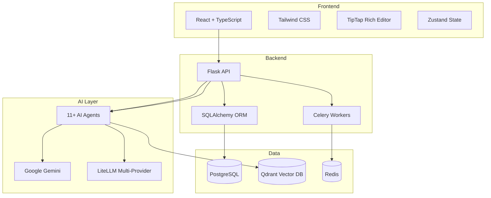
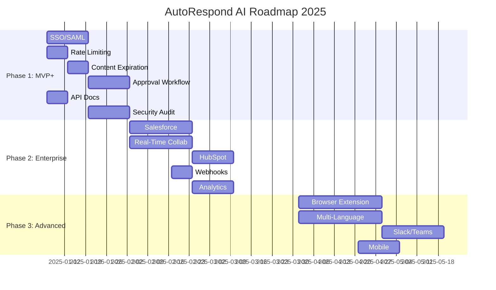

# AutoRespond AI - Comprehensive Project Analysis

**Date**: December 24, 2025  
**Project**: AutoRespond AI - RFP/RFI/Security Questionnaire Automation Platform  
**Analysis Type**: End-to-End Product, Architecture, Market & Competitiveness Review

---

## 📋 Summary

**AutoRespond AI** is an AI-powered platform for automating responses to RFPs (Request for Proposals), RFIs, and Security Questionnaires. The platform uses a multi-agent AI architecture with 11+ specialized agents, backed by a Flask/Python backend, React/TypeScript frontend, PostgreSQL, Qdrant vector database, and Redis/Celery for async processing.

### Key Strengths
- ✅ **Comprehensive AI Agent Architecture** - 11+ specialized agents for document analysis, question extraction, answer generation, compliance checking
- ✅ **Vector-Based Knowledge Search** - Qdrant integration for semantic similarity matching
- ✅ **Multi-Tenant Organization Support** - Organizations, invitations, role-based access
- ✅ **Rich Export Options** - PDF, DOCX, XLSX, PPT generation
- ✅ **Feedback Learning Loop** - AI improves from user corrections

### Critical Gaps vs. Market Leaders
- ❌ **No CRM Integrations** (Salesforce, HubSpot) - All competitors have this
- ❌ **No Real-Time Collaboration** - Competitors offer live editing
- ❌ **Limited Analytics** - Missing win/loss analysis, content performance
- ❌ **No Content Library Management** - Missing approval workflows, versioning
- ❌ **No Browser Extensions** - Competitors offer "answer anywhere"

---

## 1️⃣ Project Understanding

### Domain & Purpose
AutoRespond AI targets **sales/proposal teams** at B2B companies who respond to formal procurement requests (RFPs, RFIs, Security Questionnaires). The platform aims to reduce response time from weeks to days by:

1. **Automatically extracting questions** from uploaded RFP documents
2. **Searching organizational knowledge** for relevant answers
3. **Generating AI-powered draft responses** with citations
4. **Enabling human review and approval** of responses
5. **Exporting polished proposals** in multiple formats

### Target Users
| Role | Use Case |
|------|----------|
| Proposal Manager | Orchestrate RFP response, assign sections, track progress |
| Subject Matter Expert (SME) | Review/edit specialized sections (technical, compliance) |
| Sales Rep | Access project status, use quick answers for follow-ups |
| Admin | Manage organization, users, knowledge base setup |

### Tech Stack

### AI Agents Architecture

| Agent | Responsibility |
|-------|----------------|
| **Document Analyzer** | Parse uploaded RFP documents, extract structure |
| **Question Extractor** | Identify questions and requirements from document text |
| **Section Mapper** | Map extracted questions to proposal sections |
| **Knowledge Base Agent** | Search vector DB for relevant past answers and content |
| **Answer Generator** | Generate draft responses using knowledge context |
| **Answer Validator** | Verify answers against knowledge sources, add citations |
| **Compliance Checker** | Check answers against compliance frameworks (SOC2, GDPR, etc.) |
| **Quality Reviewer** | Score response quality, suggest improvements |
| **Clarification Agent** | Identify ambiguous requirements needing client clarification |
| **Feedback Learning Agent** | Learn from user edits to improve future responses |
| **Orchestrator Agent** | Coordinate workflow across all agents |
| **Diagram Generator** | Create Mermaid diagrams for technical sections |
| **PPT Generator** | Generate presentation slides for proposals |

---

## 2️⃣ Feature & Functionality Audit

### Core Features

| Feature | Status | Description |
|---------|--------|-------------|
| **Document Upload** | ✅ Complete | PDF, DOCX, XLSX, PPTX support with text extraction |
| **Question Extraction** | ✅ Complete | AI-powered extraction with multi-pass validation |
| **Knowledge Base** | ✅ Complete | Vector search, profiles, folders, tagging |
| **AI Answer Generation** | ✅ Complete | Chain-of-thought prompting with citations |
| **Confidence Scoring** | ✅ Complete | Answers scored 0-100% with source attribution |
| **Section Management** | ✅ Complete | 12 section types with specialized editors |
| **Export** | ✅ Complete | PDF, DOCX, XLSX, PPTX exports |
| **Review Workflow** | ✅ Partial | Basic status tracking, missing formal approval chains |
| **Multi-Tenancy** | ✅ Complete | Organization isolation, invitations |

### Supporting Features

| Feature | Status | Description |
|---------|--------|-------------|
| **Answer Library** | ✅ Complete | Save/reuse approved answers with usage tracking |
| **Go/No-Go Wizard** | ✅ Complete | Pre-RFP qualification assessment |
| **Compliance Checking** | ✅ Complete | SOC2, GDPR, HIPAA, PCI-DSS, ISO27001 |
| **Comments/Mentions** | ✅ Complete | Collaborative commenting with @mentions |
| **Notifications** | ✅ Complete | In-app and email notifications |
| **Document Versioning** | ✅ Complete | Track section edits with history |
| **Smart Search** | ✅ Complete | Semantic search across knowledge base |
| **Activity Timeline** | ✅ Complete | Project activity tracking |
| **Vendor Profile** | ✅ Complete | Auto-extract from company documents |

### Admin/Operational Features

| Feature | Status | Description |
|---------|--------|-------------|
| **User Management** | ✅ Complete | Invite, role assignment |
| **Organization Settings** | ✅ Complete | Branding, preferences |
| **AI Configuration** | ✅ Complete | Model selection (Gemini, OpenAI, LiteLLM) |
| **Audit Logging** | ✅ Complete | Track all actions |
| **API Documentation** | ❌ Missing | No Swagger/OpenAPI docs |

### Identified Issues & Gaps

#### Incomplete Flows

| Issue | Severity | Description |
|-------|----------|-------------|
| **Formal Approval Workflow** | High | No multi-level approval chain (draft → review → legal → approved) |
| **Content Library Moderation** | High | No review cycle for knowledge content freshness |
| **Template Management** | Medium | Basic templates exist but no template versioning |
| **Bulk Operations** | Medium | Limited bulk actions for questions/sections |

#### Scalability Gaps

| Issue | Severity | Description |
|-------|----------|-------------|
| **No Caching Layer** | Medium | Direct DB queries for all reads |
| **Sync Processing** | Medium | Large document processing blocks UI |
| **No Pagination Optimization** | Low | Some list endpoints fetch all records |

#### Security & Reliability

| Issue | Severity | Description |
|-------|----------|-------------|
| **JWT Token in Query Params** | Medium | Document preview uses query param tokens (workaround) |
| **No Rate Limiting** | High | API endpoints unprotected from abuse |
| **Missing Input Validation** | Medium | Some endpoints lack strict validation |
| **No API Authentication Docs** | Medium | Security practices undocumented |

---

## 3️⃣ Missing Features & Improvement Opportunities

### Must-Have for Production 🚨

| Feature | Rationale | Effort |
|---------|-----------|--------|
| **CRM Integration** (Salesforce, HubSpot) | Track RFP opportunities in CRM, auto-create projects | High |
| **Rate Limiting & API Security** | Prevent abuse, protect AI costs | Medium |
| **Real-Time Collaboration** | Multiple users editing simultaneously | High |
| **Content Approval Workflow** | Formal chain for answer library items | Medium |
| **SSO/SAML Support** | Enterprise authentication requirement | Medium |
| **API Documentation** | Developer enablement for integrations | Low |

### High-Impact User Experience

| Feature | Rationale | Effort |
|---------|-----------|--------|
| **Answer Recommendations** | Proactively suggest answers as user types | Medium |
| **@-mention SME Assignment** | Auto-route sections to subject matter experts | Low |
| **Progress Dashboards** | Visual project health indicators | Medium |
| **Search Filters** | Filter answers by date, author, usage | Low |
| **Keyboard Shortcuts** | Power user efficiency | Low |
| **Mobile Responsive** | Basic mobile access for on-the-go approvals | Medium |

### AI Accuracy & Trust

| Feature | Rationale | Effort |
|---------|-----------|--------|
| **Source Highlighting** | Show exactly which knowledge was used | Medium |
| **Confidence Explanation** | Why the AI rated answer at X% | Medium |
| **Hallucination Detection** | Flag potentially fabricated claims | High |
| **Answer Comparison** | Show alternative answer options | Medium |
| **Human Feedback Loop UI** | Easy thumbs up/down with corrections | Low |

### Advanced/Competitive Differentiators

| Feature | Rationale | Effort |
|---------|-----------|--------|
| **Win/Loss Analytics** | Track which answers correlate with wins | High |
| **Browser Extension** | Answer questions from any webpage | High |
| **Slack/Teams Integration** | Answer questions in chat | Medium |
| **AI Content Generation** | Generate new content, not just retrieve | Medium |
| **Competitive Intel Module** | Track competitor mentions in RFPs | High |
| **Multi-Language Support** | Translate responses, international RFPs | High |

---

## 4️⃣ Market & Competitor Comparison

### Competitor Overview

| Competitor | Founded | Market Position | Pricing | Key Differentiator |
|------------|---------|-----------------|---------|-------------------|
| **Loopio** | 2014 | Market Leader | Enterprise | Deep integrations, Go/No-Go in Salesforce |
| **Responsive (RFPIO)** | 2015 | Market Leader | Enterprise | Strategic Response Management (SRM) platform |
| **Qvidian** (Upland) | 1995 | Enterprise | Enterprise | 50+ years, AI Assist, deep compliance |
| **Ombud** | 2015 | Mid-Market | Mid-Market | Collaborative knowledge base |
| **PandaDoc** | 2013 | SMB | Freemium | Proposal + e-signature bundle |
| **AutoRFP.ai** | 2023 | Startup | Usage-Based | AI-first, fast draft generation |
| **Inventive AI** | 2023 | Startup | Enterprise | Contextual AI, win rate optimization |

### Feature Comparison Matrix

| Feature | AutoRespond | Loopio | Responsive | Qvidian |
|---------|-------------|--------|------------|---------|
| **Document Upload** | ✅ | ✅ | ✅ | ✅ |
| **Question Extraction** | ✅ | ✅ | ✅ | ✅ |
| **AI Answer Generation** | ✅ | ✅ | ✅ | ✅ |
| **Knowledge Base** | ✅ | ✅ | ✅ | ✅ |
| **Confidence Scoring** | ✅ | ✅ | ✅ | ✅ |
| **Export (PDF/DOCX)** | ✅ | ✅ | ✅ | ✅ |
| **Compliance Matrix** | ✅ | ✅ | ✅ | ✅ |
| **Go/No-Go Analysis** | ✅ | ✅ | ✅ | ⚠️ Partial |
| **Multi-Tenant** | ✅ | ✅ | ✅ | ✅ |
| **Salesforce Integration** | ❌ | ✅ | ✅ | ✅ |
| **HubSpot Integration** | ❌ | ✅ | ✅ | ❌ |
| **Real-Time Collaboration** | ❌ | ✅ | ✅ | ✅ |
| **Browser Extension** | ❌ | ✅ | ✅ | ❌ |
| **Mobile App** | ❌ | ⚠️ Limited | ❌ | ❌ |
| **SSO/SAML** | ❌ | ✅ | ✅ | ✅ |
| **Multi-Language** | ❌ | ✅ | ✅ | ✅ |
| **Content Expiration** | ❌ | ✅ | ✅ | ✅ |
| **Win/Loss Analytics** | ⚠️ Basic | ✅ | ✅ | ✅ |
| **Approval Workflow** | ⚠️ Basic | ✅ | ✅ | ✅ |
| **API Access** | ✅ | ✅ | ✅ | ✅ |
| **Webhooks** | ❌ | ✅ | ✅ | ✅ |

### Competitive Gaps

| Gap | Business Impact | Priority |
|-----|-----------------|----------|
| **No CRM Integration** | Cannot fit into enterprise sales workflows | 🔴 Critical |
| **No Real-Time Collab** | Teams cannot work simultaneously | 🔴 Critical |
| **No SSO/SAML** | Enterprise security blocker | 🔴 Critical |
| **Limited Analytics** | No win optimization insights | 🟡 High |
| **No Content Expiration** | Stale answers in library | 🟡 High |
| **No Browser Extension** | Missing "answer anywhere" use case | 🟡 High |
| **No Webhooks** | Cannot integrate with custom workflows | 🟢 Medium |

### Competitive Advantages (AutoRespond)

| Advantage | Description |
|-----------|-------------|
| **Modern AI Architecture** | 11+ specialized agents vs. monolithic AI in competitors |
| **Open LLM Support** | LiteLLM allows any provider (Gemini, OpenAI, Claude) |
| **Vector Search** | Qdrant for semantic search vs. keyword-based in older tools |
| **Go/No-Go Wizard** | Interactive qualification vs. basic score |
| **Specialized Editors** | 4 editor types (Narrative, Table, Card, Technical) |
| **Feedback Learning** | Explicit agent for learning from corrections |

---

## 5️⃣ Risks & Gaps

### Technical Risks

| Risk | Likelihood | Impact | Mitigation |
|------|------------|--------|------------|
| **AI Cost Overruns** | High | Medium | Token limits, caching, usage monitoring |
| **Scalability Bottleneck** | Medium | High | Add caching layer, optimize DB queries |
| **Vector DB Single Point of Failure** | Medium | High | Qdrant clustering, backup strategy |
| **Security Vulnerabilities** | Medium | Critical | Security audit, rate limiting, input validation |

### Operational Risks

| Risk | Likelihood | Impact | Mitigation |
|------|------------|--------|------------|
| **Data Privacy (GDPR)** | Medium | Critical | Data residency, encryption, DPA compliance |
| **AI Hallucinations** | High | Medium | Confidence thresholds, human review gates |
| **Knowledge Staleness** | High | Medium | Content expiration, freshness indicators |
| **User Adoption** | Medium | High | Onboarding flows, guided setup, help docs |

### Business Risks

| Risk | Likelihood | Impact | Mitigation |
|------|------------|--------|------------|
| **Feature Parity Gap** | High | High | Prioritize CRM integration, SSO |
| **Competitor Pricing** | Medium | Medium | Focus on value/ROI, not price |
| **Enterprise Sales Cycle** | High | Medium | POC process, security docs, compliance certs |

---

## 6️⃣ Recommended Roadmap

### Phase 1: Production Ready (MVP+) — 4-6 Weeks

> [!IMPORTANT]  
> These items are **blocking enterprise sales** and must be completed first.

| Priority | Feature | Effort | Owner |
|----------|---------|--------|-------|
| 🔴 P0 | **SSO/SAML Integration** | 2 weeks | Backend |
| 🔴 P0 | **Rate Limiting & API Security** | 1 week | Backend |
| 🔴 P0 | **Content Expiration Alerts** | 1 week | Full Stack |
| 🔴 P0 | **Formal Approval Workflow** | 2 weeks | Full Stack |
| 🔴 P0 | **API Documentation (Swagger)** | 1 week | Backend |
| 🟡 P1 | Security Audit & Fixes | 2 weeks | Security |

---

### Phase 2: Enterprise Integration — 6-8 Weeks

| Priority | Feature | Effort | Owner |
|----------|---------|--------|-------|
| 🔴 P0 | **Salesforce Integration** | 3 weeks | Integration |
| 🔴 P0 | **Real-Time Collaboration** (WebSocket) | 3 weeks | Full Stack |
| 🟡 P1 | HubSpot Integration | 2 weeks | Integration |
| 🟡 P1 | Webhooks API | 1 week | Backend |
| 🟡 P1 | Win/Loss Analytics Dashboard | 2 weeks | Full Stack |

---

### Phase 3: Advanced Capabilities — 8-12 Weeks

| Priority | Feature | Effort | Owner |
|----------|---------|--------|-------|
| 🟡 P1 | **Browser Extension** | 4 weeks | Frontend |
| 🟡 P1 | **Multi-Language Support** | 4 weeks | Full Stack |
| 🟢 P2 | Slack/Teams Integration | 3 weeks | Integration |
| 🟢 P2 | Mobile Responsive Updates | 2 weeks | Frontend |
| 🟢 P2 | AI Content Generation (not just retrieval) | 4 weeks | AI |
| 🟢 P2 | Competitive Intelligence Module | 6 weeks | Full Stack |

---

### Roadmap Timeline

---

## Appendix: Current Feature Matrix

### Backend Services (28)

| Service | Purpose |
|---------|---------|
| `ai_service.py` | Core AI generation orchestration |
| `ai_config_service.py` | AI model configuration |
| `answer_reuse_service.py` | Find and apply reusable answers |
| `chunking_service.py` | Document text chunking for embeddings |
| `classification_service.py` | Section type classification |
| `compliance_service.py` | Compliance framework checking |
| `email_service.py` | Email notifications |
| `export_service.py` | PDF/DOCX/XLSX/PPTX export |
| `extraction_service.py` | Document content extraction |
| `feedback_service.py` | User feedback collection |
| `go_no_go_service.py` | Pre-RFP qualification |
| `knowledge_service.py` | Knowledge base management |
| `mermaid_service.py` | Diagram generation |
| `pdf_service.py` | PDF processing |
| `ppt_service.py` | PowerPoint generation |
| `qdrant_service.py` | Vector database operations |
| `quality_service.py` | Response quality scoring |
| `reminder_service.py` | Due date reminders |
| `section_generation_service.py` | AI section generation |
| `slack_service.py` | Slack notifications |
| `tagging_service.py` | Content tagging |

### Frontend Pages (14)

| Page | Purpose |
|------|---------|
| `Dashboard.tsx` | Main dashboard with stats, charts, recent projects |
| `Projects.tsx` | Project list and management |
| `ProjectDetail.tsx` | Single project overview |
| `ProposalBuilder.tsx` | Main editing interface for sections |
| `AnswerWorkspace.tsx` | Dedicated Q&A answering interface |
| `KnowledgeBase.tsx` | Knowledge library management |
| `AnswerLibrary.tsx` | Saved answers with reuse |
| `Settings.tsx` | User + Organization settings |
| `TemplatesManager.tsx` | Proposal templates |
| `DocumentVersioning.tsx` | Version history for sections |
| `AcceptInvite.tsx` | Team invitation flow |

---

## Conclusion

AutoRespond AI has a **solid technical foundation** with a modern AI agent architecture that rivals newer entrants like Inventive AI and AutoRFP.ai. The platform excels in document processing, AI answer generation, and specialized section editing.

However, to compete with market leaders (Loopio, Responsive, Qvidian), the platform must urgently address:

1. **Enterprise integrations** (Salesforce, SSO)
2. **Real-time collaboration**
3. **Content lifecycle management** (expiration, approval chains)
4. **Analytics & Insights**

With 4-6 weeks of focused development on Phase 1, AutoRespond can achieve parity on critical features. Phases 2-3 position the product for **competitive differentiation** through advanced AI capabilities like browser extensions and multi-language support.

> [!TIP]
> **Quick Win**: Salesforce integration alone opens enterprise sales pipeline. Prioritize this for fastest revenue impact.
