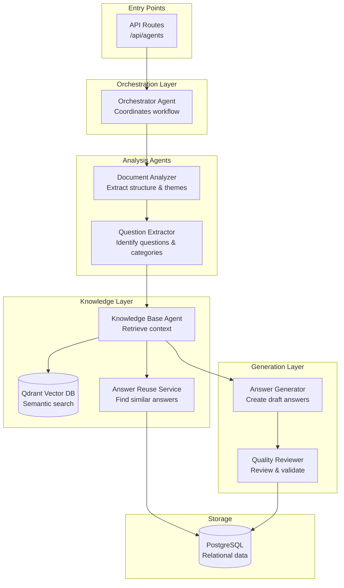
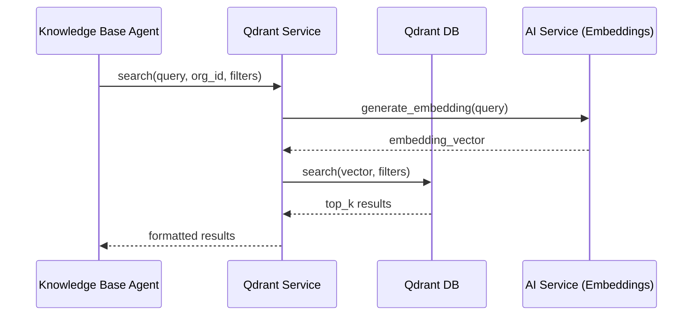
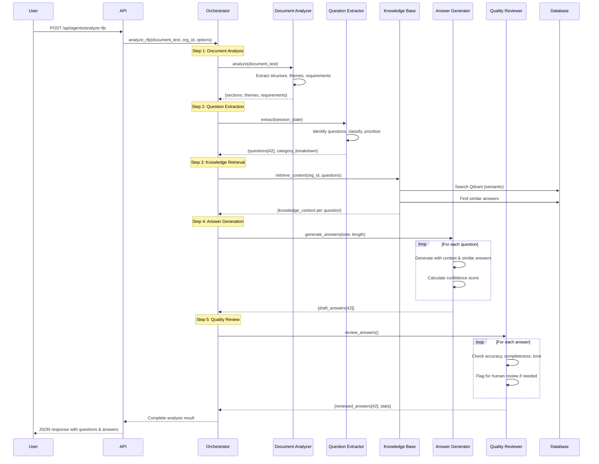

# RFP Agent System - Architecture & Flow Analysis

## Executive Summary

The RFP system implements a **multi-agent architecture** using Google ADK (Agent Development Kit) with 6 specialized agents that work together to analyze RFP documents, extract questions, retrieve relevant knowledge, and generate high-quality answers.

## Agent Architecture Overview



## Agent Details

### 1️⃣ Orchestrator Agent

**Purpose**: Main coordinator that manages the sequential workflow

**Location**: [`orchestrator_agent.py`](file:///home/bharathkumarr/AI-hackathon/RFP-project/V1/backend/app/agents/orchestrator_agent.py)

**Key Methods**:
- `analyze_rfp()` - Full workflow execution
- `analyze_document_only()` - Step 1 only
- `extract_questions_only()` - Steps 1-2
- `generate_answers_for_questions()` - Steps 3-5 for provided questions

**Workflow Steps**:
1. Document Analysis → Extract structure & themes
2. Question Extraction → Identify all questions
3. Knowledge Retrieval → Get relevant context
4. Answer Generation → Create draft answers
5. Quality Review → Validate & improve

---

### 2️⃣ Document Analyzer Agent

**Purpose**: Analyzes RFP document structure and extracts metadata

**Location**: [`document_analyzer_agent.py`](file:///home/bharathkumarr/AI-hackathon/RFP-project/V1/backend/app/agents/document_analyzer_agent.py)

**Extracts**:
- Document sections and structure
- Key themes (security, compliance, technical, etc.)
- Requirements (mandatory vs. optional)
- Evaluation criteria
- Deliverables and timeline
- Document type and complexity score

**AI Prompt**: Structured JSON extraction with fallback to regex patterns

**Session State**: 
- Writes: `DOCUMENT_TEXT`, `DOCUMENT_STRUCTURE`

---

### 3️⃣ Question Extractor Agent

**Purpose**: Identifies and classifies all questions requiring vendor responses

**Location**: [`question_extractor_agent.py`](file:///home/bharathkumarr/AI-hackathon/RFP-project/V1/backend/app/agents/question_extractor_agent.py)

**Question Types Detected**:
- Direct questions (ending with ?)
- Imperative statements (Provide, Describe, Explain)
- Requirement statements (The vendor must/shall)
- Checkbox/form items
- Table completion requests

**Categories**: security, compliance, technical, pricing, legal, product, support, integration, general

**Output**:
```json
{
  "questions": [
    {
      "id": 1,
      "text": "Question text",
      "category": "security",
      "mandatory": true,
      "priority": "critical|high|medium|low",
      "section_reference": "Section name"
    }
  ],
  "total_count": 42,
  "category_breakdown": {...}
}
```

**Session State**:
- Reads: `DOCUMENT_TEXT`, `DOCUMENT_STRUCTURE`
- Writes: `EXTRACTED_QUESTIONS`

---

### 4️⃣ Knowledge Base Agent

**Purpose**: Retrieves relevant context from knowledge base for answering questions

**Location**: [`knowledge_base_agent.py`](file:///home/bharathkumarr/AI-hackathon/RFP-project/V1/backend/app/agents/knowledge_base_agent.py)

**Key Features**:
- ✅ Qdrant vector database integration
- ✅ Multi-dimensional filtering (geography, client_type, industry, etc.)
- ✅ Knowledge profile support
- ✅ Lazy loading of services

**Search Parameters**:
```python
retrieve_context(
    questions: List[Dict],
    org_id: int,
    geography: str,        # US, EU, APAC
    client_type: str,      # government, private
    industry: str,         # healthcare, finance
    knowledge_profile_ids: List[int]
)
```

**For Each Question Retrieves**:
1. **Knowledge Items** (from Qdrant) - Relevant company documentation, policies, certifications
2. **Similar Answers** (from Answer Reuse Service) - Previously approved answers to similar questions

**Session State**:
- Reads: `EXTRACTED_QUESTIONS`
- Writes: `KNOWLEDGE_CONTEXT`

---

### 5️⃣ Answer Generator Agent

**Purpose**: Generates AI-powered answers using RAG (Retrieval-Augmented Generation)

**Location**: [`answer_generator_agent.py`](file:///home/bharathkumarr/AI-hackathon/RFP-project/V1/backend/app/agents/answer_generator_agent.py)

**Configurable Parameters**:
- **Tone**: professional, formal, friendly
- **Length**: short (2-3 sentences), medium (4-6 sentences), long (detailed with examples)

**Category-Specific Instructions**:
- Security questions → Reference certifications, encryption standards
- Compliance questions → Reference frameworks, certification status
- Technical questions → Provide specific details, version numbers
- Pricing questions → Clear structure, suggest sales contact
- Legal questions → Cautious language, suggest legal team involvement

**Confidence Scoring**:
- Base: 0.4
- High-relevance knowledge items (+0.2)
- Multiple knowledge items (+0.1)
- High-similarity previous answers (+0.25)

**Output**:
```json
{
  "question_id": 1,
  "answer": "Generated answer text",
  "confidence_score": 0.85,
  "flags": ["review_recommended"],
  "sources": [...]
}
```

**Session State**:
- Reads: `EXTRACTED_QUESTIONS`, `KNOWLEDGE_CONTEXT`
- Writes: `DRAFT_ANSWERS`

---

### 6️⃣ Quality Reviewer Agent

**Purpose**: Reviews generated answers for accuracy, compliance, and quality

**Location**: [`quality_reviewer_agent.py`](file:///home/bharathkumarr/AI-hackathon/RFP-project/V1/backend/app/agents/quality_reviewer_agent.py)

**Review Criteria**:
1. **Accuracy** - Alignment with context
2. **Completeness** - Fully addresses question
3. **Tone** - Professional and appropriate
4. **Claims** - All claims verifiable from context
5. **Compliance** - Accurate security/compliance statements

**Output**:
```json
{
  "quality_score": 0.85,
  "issues": ["Minor issue detected"],
  "improvements": ["Suggestion"],
  "needs_human_review": false,
  "review_reason": "...",
  "revised_answer": "Improved answer text"
}
```

**Fallback Review** (when AI unavailable):
- Checks answer length (< 50 chars = too brief)
- Detects placeholder text
- Defaults to human review required

**Session State**:
- Reads: `DRAFT_ANSWERS`, `KNOWLEDGE_CONTEXT`
- Writes: `REVIEWED_ANSWERS`

---

## Knowledge Base Integration

### Database Schema

**KnowledgeItem Model** ([`knowledge.py`](file:///home/bharathkumarr/AI-hackathon/RFP-project/V1/backend/app/models/knowledge.py)):

```python
class KnowledgeItem:
    # Core fields
    title: str
    content: str
    tags: List[str]
    category: str  # security, compliance, product, legal
    
    # Multi-dimensional filters
    geography: str       # US, EU, APAC
    client_type: str     # government, private
    currency: str        # USD, EUR, GBP
    industry: str        # healthcare, finance
    language: str        # en, es, de
    
    # Advanced features
    compliance_frameworks: List[str]  # SOC2, ISO27001, GDPR
    knowledge_profile_id: int
    embedding_id: str    # Qdrant point ID
    
    # File storage
    file_data: bytes     # Binary content
    file_type: str
    file_size: int
    
    # Usage tracking
    usage_count: int
    last_used_at: datetime
```

### Qdrant Vector Database

**Service**: [`qdrant_service.py`](file:///home/bharathkumarr/AI-hackathon/RFP-project/V1/backend/app/services/qdrant_service.py)

**Collection**: `knowledge_base`

**Features**:
- Semantic search using embeddings
- Multi-dimensional filtering
- Organization-scoped search
- Automatic embedding generation

**Search Flow**:


### Answer Reuse Service

**Service**: [`answer_reuse_service.py`](file:///home/bharathkumarr/AI-hackathon/RFP-project/V1/backend/app/services/answer_reuse_service.py)

**Purpose**: Find and reuse previously approved answers

**Features**:
- Semantic similarity search via Qdrant
- Category filtering
- Keyword search fallback
- Automatic indexing of approved answers

---

## Complete Agent Workflow



---

## API Endpoints

### 1. Full RFP Analysis

```
POST /api/agents/analyze-rfp
```

**Request**:
```json
{
  "document_id": 123,
  "org_id": 456,
  "options": {
    "tone": "professional",
    "length": "medium"
  }
}
```

**Response**:
```json
{
  "success": true,
  "steps_completed": ["document_analysis", "question_extraction", "knowledge_retrieval", "answer_generation", "quality_review"],
  "document_analysis": {...},
  "questions": [42 questions],
  "answers": [42 answers],
  "stats": {
    "total": 42,
    "average_quality": 0.82,
    "needs_human_review": 5
  },
  "agent_log": [...]
}
```

### 2. Document Analysis Only

```
POST /api/agents/analyze-document
```

### 3. Question Extraction Only

```
POST /api/agents/extract-questions
```

### 4. Generate Answers for Questions

```
POST /api/agents/generate-answers
```

**Request**:
```json
{
  "questions": [
    {"id": 1, "text": "...", "category": "security"}
  ],
  "org_id": 456,
  "options": {"tone": "professional", "length": "medium"}
}
```

### 5. Health Check

```
GET /api/agents/health
```

**Response**:
```json
{
  "status": "ok",
  "adk_enabled": true,
  "api_configured": true,
  "model": "gemini-1.5-flash",
  "agents": ["DocumentAnalyzerAgent", ...]
}
```

---

## Missing Functionality & Recommendations

### ✅ What's Working Well

1. **Complete multi-agent workflow** - All 5 steps implemented
2. **Knowledge base integration** - Qdrant vector search works
3. **Multi-dimensional filtering** - Geography, client type, industry supported
4. **Answer reuse** - Similar answer retrieval functional
5. **Confidence scoring** - Multiple factors considered
6. **Quality review** - AI-based validation implemented
7. **Graceful degradation** - Fallback logic when AI unavailable

### ⚠️ Potential Missing Functionality

#### 1. **No Clarification Question Handling in Agents** ⭐

> **Issue**: The conversation history (#64d2feaa) shows a "Clarification Questions" feature exists in the frontend ([`SectionEditor`](file:///home/bharathkumarr/AI-hackathon/RFP-project/V1/frontend/src/components/answer/SimilarAnswerSuggestion.tsx)), but there's **no agent** specifically designed to:
> - Generate clarification questions when context is insufficient
> - Identify ambiguous RFP questions
> - Suggest questions to ask the client

**Recommendation**: Create `ClarificationAgent` that:
- Analyzes questions with low confidence scores
- Identifies missing information
- Generates targeted clarification questions
- Integrates between steps 3 and 4

#### 2. **No Project Context in Knowledge Retrieval** ⚠️

> **Issue**: The Knowledge Base Agent accepts `org_id` and dimension filters, but **doesn't receive project-specific context** like:
> - Project name
> - Client name  
> - Project metadata
> - Previously answered questions in this project

**Current Code**:
```python
# knowledge_base_agent.py - line 51
def retrieve_context(
    self,
    questions: List[Dict] = None,
    org_id: int = None,
    geography: str = None,
    client_type: str = None,
    industry: str = None,
    knowledge_profile_ids: List[int] = None
) -> Dict:
```

**What's Missing**: `project_id` parameter to:
- Filter knowledge by project dimensions automatically
- Access project-specific knowledge profiles
- Consider project context in similarity matching

**Recommendation**: Update signature to:
```python
def retrieve_context(
    self,
    questions: List[Dict] = None,
    org_id: int = None,
    project_id: int = None,  # NEW
    # ... existing params
)
```

And fetch project dimensions automatically from database.

#### 3. **No Batch Processing / Async Support** ⚠️

> **Issue**: Current workflow is **completely synchronous**. For large RFPs with 100+ questions:
> - Long processing time (5+ minutes)
> - No progress updates
> - Cannot cancel mid-process
> - Frontend has to wait for complete response

**Evidence**: [`orchestrator_agent.py`](file:///home/bharathkumarr/AI-hackathon/RFP-project/V1/backend/app/agents/orchestrator_agent.py) - line 82-169 is a single synchronous flow

**Recommendation**: 
- Integrate with **Celery** (already set up - see [`START_CELERY_WORKER.sh`](file:///home/bharathkumarr/AI-hackathon/RFP-project/V1/START_CELERY_WORKER.sh))
- Create Celery task for `analyze_rfp`
- Use WebSocket or SSE for progress updates
- Store intermediate results in database

#### 4. **No Telemetry / Observability** ⚠️

> **Issue**: The conversation history (#c8ae849d) mentions **Opik for telemetry**, but:
> - No Opik integration found in agent code
> - No structured logging of agent decisions
> - No performance metrics (time per step)
> - No cost tracking (API calls to Gemini)

**Recommendation**:
- Add Opik instrumentation to each agent
- Log decision traces (why certain knowledge was selected)
- Track token usage and costs
- Monitor agent performance

#### 5. **Limited Error Handling Between Agents** ⚠️

> **Issue**: While each agent has try/catch blocks, there's **no sophisticated error recovery**:
> - If Step 2 (question extraction) fails completely, workflow stops
> - No retry logic with exponential backoff
> - No fallback to simpler AI models when main model fails

**Current Code**: [`orchestrator_agent.py`](file:///home/bharathkumarr/AI-hackathon/RFP-project/V1/backend/app/agents/orchestrator_agent.py) - lines 92-94:
```python
if not doc_result.get("success"):
    result["error"] = "Document analysis failed"
    return self._finalize_result(result, session_state)
```

**Recommendation**:
- Implement retry decorator with exponential backoff
- Try `gemini-1.5-flash` → `gemini-1.5-pro` → fallback extraction
- Continue workflow even if some steps partially fail

#### 6. **No Fine-tuning / Learning Loop** 💡

> **Issue**: The agents don't learn from:
> - Human edits to generated answers
> - Approved vs. rejected answers
> - User feedback on answer quality

**Recommendation**:
- Store quality feedback in database
- Create feedback loop to improve prompts
- Consider fine-tuning Gemini models with approved answers
- Use reinforcement learning from human feedback (RLHF)

#### 7. **No Multi-language Support in Agents** 💡

> **Issue**: Knowledge items support `language` field, but:
> - Agents don't detect RFP language
> - No translation capabilities
> - No language-specific prompt templates

**Recommendation**:
- Add language detection in Document Analyzer
- Create language-specific generation prompts
- Integrate translation API for multi-lingual RFPs

#### 8. **No Collaborative Editing / Conflict Resolution** 💡

> **Issue**: Multiple users might work on same RFP simultaneously:
> - No locking mechanism
- No conflict detection
> - No version control for agent-generated content

**Recommendation**:
- Implement optimistic locking on answers
- Add version tracking to generated answers
- Create merge strategies for concurrent edits

---

## Configuration

**Environment Variables Required**:

```bash
# Google AI
GOOGLE_API_KEY=your_api_key
GOOGLE_MODEL=gemini-1.5-flash  # or gemini-1.5-pro

# Qdrant
QDRANT_URL=http://localhost:6333
QDRANT_API_KEY=optional_api_key

# Database
DATABASE_URL=postgresql://...
```

---

## Session State Communication

Agents communicate via shared `session_state` dictionary:

| Key | Written By | Read By | Description |
|-----|-----------|---------|-------------|
| `DOCUMENT_TEXT` | Document Analyzer | Question Extractor | Raw document text |
| `DOCUMENT_STRUCTURE` | Document Analyzer | Question Extractor | Parsed structure |
| `EXTRACTED_QUESTIONS` | Question Extractor | KB Agent, Answer Generator | All identified questions |
| `KNOWLEDGE_CONTEXT` | KB Agent | Answer Generator, Quality Reviewer | Context per question |
| `DRAFT_ANSWERS` | Answer Generator | Quality Reviewer | Initial answers |
| `REVIEWED_ANSWERS` | Quality Reviewer | Orchestrator | Final validated answers |
| `AGENT_MESSAGES` | All Agents | Orchestrator | Activity log |
| `CURRENT_STEP` | Orchestrator | All Agents | Current workflow step |
| `ERRORS` | All Agents | Orchestrator | Error tracking |

---

## Technology Stack

- **Framework**: Flask (Python 3.x)
- **AI**: Google ADK + Gemini 1.5
- **Vector DB**: Qdrant
- **Database**: PostgreSQL
- **ORM**: SQLAlchemy
- **Workers**: Celery (configured but not used by agents)
- **Frontend**: React + TypeScript + Vite

---

## Quick Start

### 1. Check Agent Health

```bash
curl http://localhost:5001/api/agents/health
```

### 2. Run Full Analysis

```python
import requests

response = requests.post('http://localhost:5001/api/agents/analyze-rfp', json={
    "document_text": "Your RFP text here...",
    "org_id": 1,
    "options": {
        "tone": "professional",
        "length": "medium"
    }
})

result = response.json()
print(f"Found {len(result['questions'])} questions")
print(f"Generated {len(result['answers'])} answers")
print(f"Average quality: {result['stats']['average_quality']}")
```

### 3. Use Individual Agents

```python
from app.agents import (
    get_document_analyzer_agent,
    get_question_extractor_agent,
    get_knowledge_base_agent
)

# Analyze document structure
doc_agent = get_document_analyzer_agent()
result = doc_agent.analyze(document_text, session_state={})

# Extract questions
qex_agent = get_question_extractor_agent()
questions = qex_agent.extract(session_state=result['session_state'])

# Get knowledge context
kb_agent = get_knowledge_base_agent()
context = kb_agent.retrieve_context(
    questions=questions['questions'],
    org_id=1,
    geography='US',
    industry='healthcare'
)
```

---

## Priority Recommendations

### 🔴 High Priority (Critical for Production)

1. **Add Celery async processing** for large RFPs
2. **Implement project context passing** to Knowledge Base Agent
3. **Add robust error recovery** with retries

### 🟡 Medium Priority (Quality Improvements)

4. **Create Clarification Agent** for low-confidence questions
5. **Add Opik telemetry** for observability
6. **Implement feedback loop** for continuous improvement

### 🟢 Low Priority (Nice to Have)

7. **Multi-language support** in agents
8. **Collaborative editing** with conflict resolution
9. **Fine-tuning** with approved answers

---

## Next Steps

1. **Review this analysis** with the team
2. **Prioritize missing functionality** based on business needs
3. **Create implementation plan** for top 3 priorities
4. **Test current workflow** with real RFP documents
5. **Monitor agent performance** and iterate

---

**Document Version**: 1.0  
**Last Updated**: 2025-12-17  
**Analyzed By**: Antigravity AI Assistant
