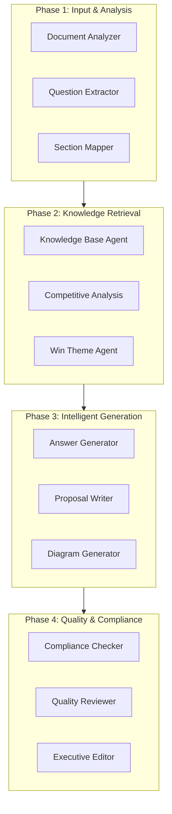

# AI Agents

RFP Pro employs a **sophisticated multi-agent architecture** powered by Google Gemini 2.0. By breaking down the complex task of proposal writing into specialized roles, we achieve higher accuracy, better compliance, and superior content quality.

## Agent Orchestration

The **Agent Orchestrator** acts as the central nervous system of RFP Pro. It uses Gemini 2.0's advanced reasoning capabilities to:
1. **Deconstruct Tasks**: Break down a user request (e.g., "Generate Section 2.1") into sub-tasks.
2. **Assign Agents**: Route sub-tasks to the most appropriate specialized agents.
3. **Consolidate Knowledge**: Aggregate results from multiple agents into a coherent final output.
4. **Self-Correction**: Re-run agents if quality checks or compliance validations fail.

## Agent Categories & Workflow

### 1. Analysis Agents
These agents handle the heavy lifting of document understanding.
- **Document Analyzer**: Uses vision and text analysis to understand layout and content of complex PDFs and Word docs.
- **Question Extractor**: Specifically identifies implicit and explicit requirements/questions within the RFP.
- **Section Mapper**: Aligns extracted requirements with the target proposal structure.

### 2. Knowledge Agents
Focused on retrieving and contextualizing information.
- **Knowledge Base Agent**: Interfaces with Qdrant to find the most relevant past proposals and technical snippets.
- **Competitive Analysis Agent**: Researches market trends and competitor data to provide a strategic edge.
- **Win Theme Agent**: Identifies and emphasizes unique value propositions throughout the proposal.

### 3. Generation Agents
The "creative" engine of RFP Pro.
- **Answer Generator**: Creates the first technical draft based on RAG context.
- **Proposal Writer**: Polishes the draft for flow, clarity, and impact.
- **Diagram Generator**: Converts technical descriptions into Mermaid.js code for visual representation.

### 4. Quality Agents
Ensuring every proposal is "bid-ready."
- **Compliance Checker**: Performs a line-by-line audit against the original RFP requirements.
- **Quality Reviewer**: Scores the content against best practices and historical winning benchmarks.
- **Executive Editor**: Final pass for tone consistency and professional formatting.

## Full Agent Capabilities

| # | Agent Name | Core Responsibility |
|---|------------|---------------------|
| 1 | Document Analyzer | Deep document parsing & OCR |
| 2 | Question Extractor | Requirement & question identification |
| 3 | Section Mapper | Template alignment |
| 4 | Knowledge Base Agent | RAG context retrieval |
| 5 | Competitive Analysis | Strategic market positioning |
| 6 | Win Theme Agent | Value proposition highlighting |
| 7 | Answer Generator | Technical draft creation |
| 8 | Proposal Writer | Content polishing & flow |
| 9 | Diagram Generator | Mermaid.js visualization |
| 10 | Compliance Checker | Gap analysis & requirement tracking |
| 11 | Quality Reviewer | Content scoring & feedback |
| 12 | Executive Editor | Tone & consistency management |
| 13-25 | Specialized Utilities | Legal, Pricing, Translation, Feedback Learning, etc. |
