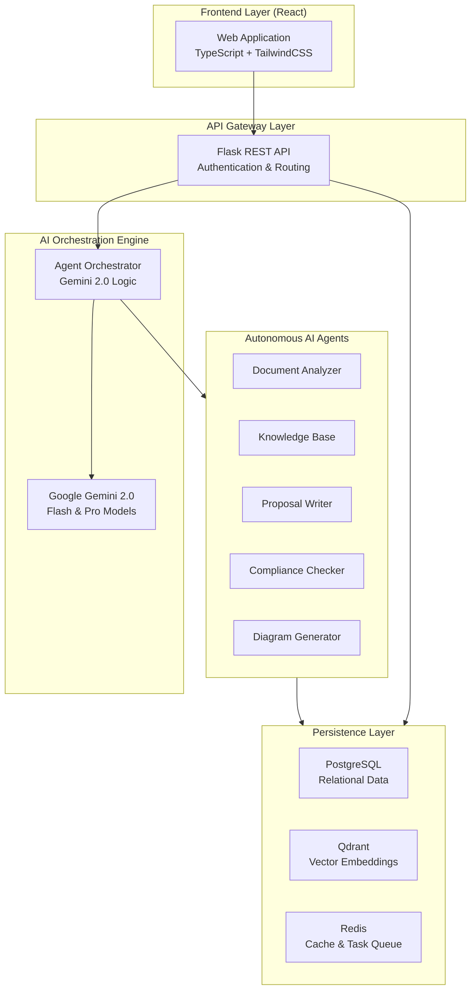
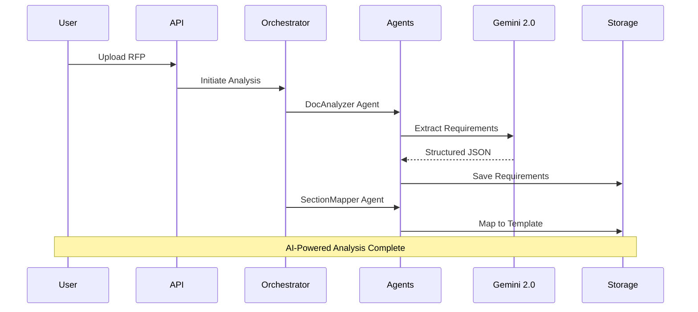

# System Architecture

RFP Pro is built on a modern, scalable microservices-inspired architecture designed to handle complex AI workloads and document processing.

## High-Level Architecture

## Component Details

### Frontend Layer
- **Framework**: React 18 with TypeScript for type-safe development.
- **Styling**: TailwindCSS for a modern, responsive UI.
- **State Management**: Zustand for lightweight and efficient global state.
- **Rich Text Editing**: TipTap for a seamless proposal editing experience.
- **Visuals**: Mermaid.js for rendering AI-generated diagrams.

### API Layer
- **Framework**: Flask (Python 3.11) provides a robust RESTful API.
- **Security**: JWT-based authentication for secure session management.
- **Concurrency**: Celery with Redis backend for handling long-running AI tasks.
- **Processing**: Specialized services for PDF, DOCX, and XLSX parsing.

### AI Engine (Gemini 2.0)
The heart of RFP Pro is the **Google Gemini 2.0 Flash** model, coordinated by a custom Agent Orchestrator. 
- **Agent Development Kit (ADK)**: Used to define and manage 25+ specialized agents.
- **Dynamic Prompting**: Context-aware prompt engineering based on RAG results.
- **Function Calling**: Used for structured data extraction and tool usage.

### Storage & Search
- **PostgreSQL**: Stores structured data like users, projects, and compliance matrices.
- **Qdrant Vector DB**: High-performance semantic search for the RAG pipeline.
- **Redis**: Provides fast caching and serves as the message broker for Celery workers.

## Multi-Agent Workflow

