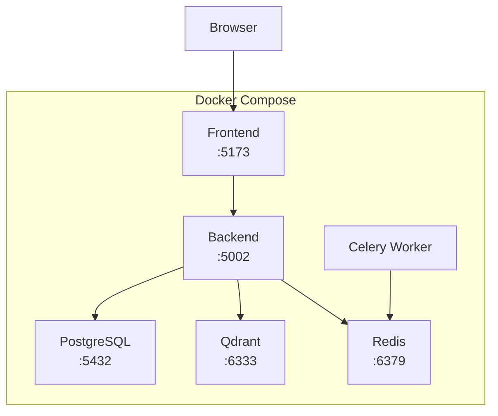

# Deployment

## Docker Compose Deployment

### Architecture



### Services

| Service | Port | Description |
|---------|------|-------------|
| frontend | 5173 | React application |
| backend | 5002 | Flask API |
| celery | - | Background worker |
| postgres | 5432 | Database |
| qdrant | 6333 | Vector DB |
| redis | 6379 | Cache |

## Environment Variables

```bash
# Required
GOOGLE_API_KEY=your-gemini-api-key
SECRET_KEY=your-jwt-secret

# Auto-configured by Docker
DATABASE_URL=postgresql://...
QDRANT_URL=http://qdrant:6333
REDIS_URL=redis://redis:6379
```

## Commands

### Start
```bash
docker compose up -d
```

### View Logs
```bash
docker compose logs -f
docker compose logs backend -f
```

### Restart Service
```bash
docker compose restart backend
```

### Stop
```bash
docker compose down
```

### Reset Database
```bash
docker compose down -v
docker compose up -d
```

### Rebuild
```bash
docker compose up -d --build
```

## Health Checks

| Endpoint | Expected |
|----------|----------|
| http://localhost:5173 | Frontend UI |
| http://localhost:5002/api/health | {"status": "ok"} |
| http://localhost:6333/collections | Qdrant collections |
