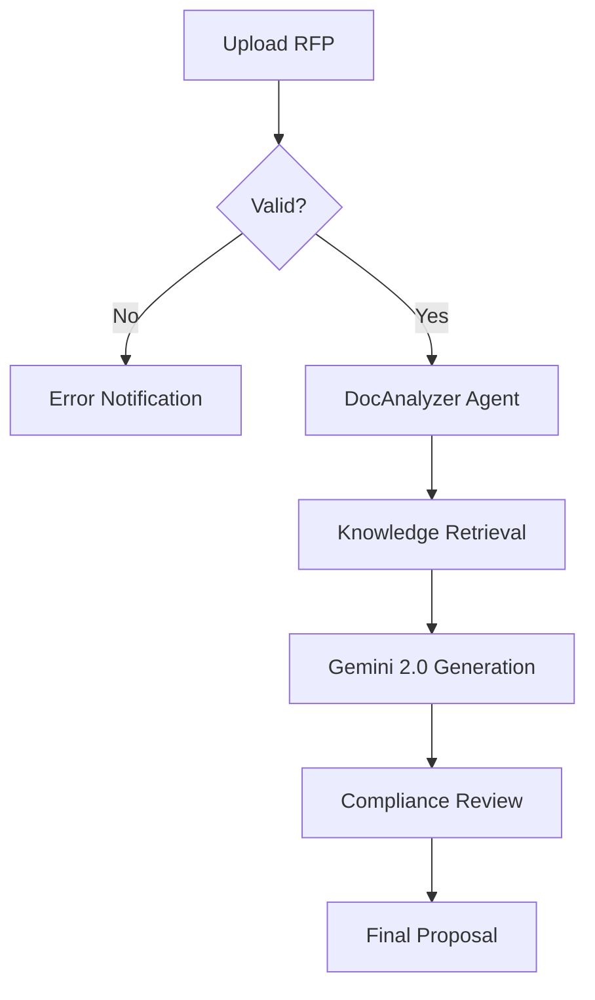

# Diagrams

RFP Pro features an integrated **AI Diagram Generator** that translates complex technical descriptions into professional visualizations using Mermaid.js.

## Supported Diagram Types

- **Architecture Diagrams**: For system designs and infrastructure layouts.
- **Flowcharts**: For business processes and user journeys.
- **Sequence Diagrams**: For timing and interaction logic.
- **Gantt Charts**: For project timelines and implementation schedules.

## How to Generate

### 1. Select a Technical Section
Navigate to a section like "System Architecture" or "Implementation Plan."

### 2. Trigger AI Generation
Click the **"Generate Diagram"** button in the editor toolbar. The AI will analyze the section content and propose a visualization.

### 3. Review & Edit
The diagram will render instantly. You can hover over elements to zoom, or click **"Edit Source"** to manually tweak the Mermaid code.

## Mermaid.js Integration

RFP Pro uses standard Mermaid.js syntax, allowing for immense flexibility. Here is an example of what our AI can generate for a processing flow:

## Tips for Better Diagrams
- Provide clear, step-by-step descriptions in the text.
- Use bullet points for processes you want visualized.
- Use the AI Assistant to "add more detail to the diagram" if needed.
