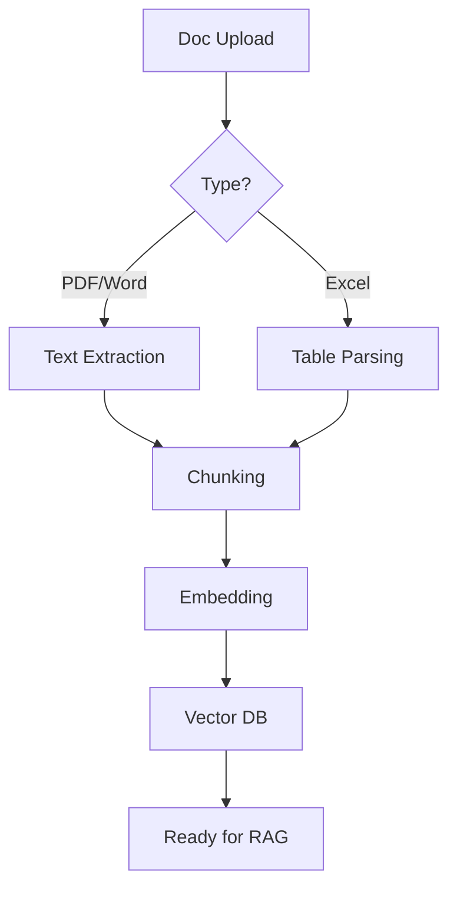

# Document Management

RFP Pro uses a sophisticated processing pipeline to turn your static documents into a dynamic, searchable, and AI-ready library.

## Supported Formats
- **PDF (.pdf)**: Best for final RFP documents and technical whitepapers.
- **Word (.docx)**: Ideal for existing proposal drafts and templates.
- **Excel (.xlsx)**: Perfect for requirement lists and pricing tables.
- **PowerPoint (.pptx)**: Great for company overview and technical architecture slides.

## The Upload Workflow
### 1. Project Context
Start by navigating to your specific project workspace. Every project has its own isolated knowledge base.

### 2. Intelligent Upload
Click the **"Upload Documents"** button. You can drag and drop multiple files at once.

### 3. AI Processing Pipeline
Once uploaded, your documents go through our **Extraction Engine**:
- **OCR & Parsing**: We extract text, tables, and even metadata.
- **Semantic Chunking**: The AI splits documents into logical, context-preserving segments.
- **Vectorization**: Each segment is converted into a high-dimensional vector for instant retrieval.

## What Happens Behind the Scenes

## Best Practices
- **Upload the RFP First**: This gives the AI the primary requirements context.
- **Include Past Proposals**: The more winning content you upload, the better the AI can mimic your style.
- **Keep Files Clean**: Remove unnecessary images or large media components to speed up processing.
- **Check Status**: Wait for the "Processed" badge before starting content generation.
