# Overview

## Problem Statement

Organizations face significant challenges when responding to RFPs:

| Challenge | Impact |
|-----------|--------|
| Manual Analysis | Days extracting requirements from complex documents |
| Inconsistent Responses | Variable quality across different teams and proposals |
| Knowledge Silos | Best practices and past winning content not reused |
| Compliance Gaps | Missed requirements leading to immediate disqualification |
| Time Pressure | Tight deadlines often lead to rushed, sub-optimal responses |

## Solution: RFP Pro

RFP Pro transforms the proposal creation process into a streamlined AI-driven workflow:

```mermaid
flowchart LR
    A[📄 Upload RFP] --> B[🤖 AI Analyzes]
    B --> C[📝 Generate Content]
    C --> D[✅ Check Compliance]
    D --> E[📤 Export]
```

By leveraging **Google Gemini 2.0** and a sophisticated **RAG (Retrieval Augmented Generation)** architecture, RFP Pro reduces proposal preparation time from **weeks to hours**.

## Key Benefits

- **⏱️ 80% Time Saving**: Automate repetitive tasks and focus on strategy.
- **🤖 25+ AI Agents**: Specialized agents for every stage of the proposal.
- **✅ 100% Compliance**: Never miss a requirement with AI-powered tracking.
- **📊 Auto Diagrams**: Professional architecture and flowcharts in seconds.
- **📚 Knowledge Reuse**: Instant access to your entire library of past proposals.

## Core Features

### 1. Advanced Document Analysis
Multi-format support for PDF, DOCX, and XLSX. Our AI doesn't just read text; it understands the structure, identifies requirements, and extracts key entities automatically.

### 2. RAG-Powered Knowledge Base
Your past work is your greatest asset. RFP Pro indexes your previous proposals and technical documents into a vector database (Qdrant), allowing the AI to retrieve exact, relevant context for every new question.

### 3. AI Content Generation
Powered by Gemini 2.0, our generation engine creates tailored, context-aware content that matches your brand voice and technical excellence.

### 4. Interactive AI Assistant
Refine content in real-time. Ask the assistant to "make this more technical," "shorten for executive summary," or "add specific metrics" instantly.

### 5. Automated Compliance Matrix
The platform automatically generates and maintains a compliance matrix, tracking how and where every requirement is addressed in your response.

## Key Differentiators

| Feature | RFP Pro | Traditional Tools |
|---------|---------|-------------------|
| **AI Generation** | ✅ Gemini 2.0 | ❌ Manual writing |
| **Knowledge Reuse** | ✅ Vector RAG | ❌ Keyword search only |
| **Diagram Generation** | ✅ Automatic Mermaid | ❌ Manual drawing |
| **Compliance** | ✅ AI-verified | ❌ Manual checklists |
| **Time to Proposal** | **Hours** | **Weeks** |
