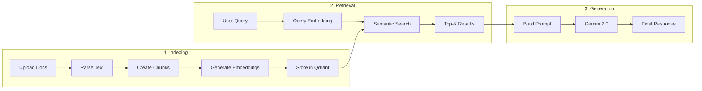

# RAG Pipeline

## What is RAG?

**RAG (Retrieval Augmented Generation)** enhances AI responses by retrieving relevant context from a knowledge base before generating content.

## How It Works

## Components

### 1. Document Indexing
- **Parsing**: Extract text from PDF, DOCX, XLSX
- **Chunking**: Split into 500-1000 token chunks with overlap
- **Embedding**: Generate vector embeddings
- **Storage**: Store in Qdrant vector database

### 2. Retrieval
- **Query Embedding**: Convert user query to vector
- **Semantic Search**: Find similar chunks using cosine similarity
- **Top-K Selection**: Return most relevant chunks

### 3. Generation
- **Prompt Building**: Combine query + retrieved context
- **LLM Processing**: Gemini 2.0 generates response
- **Post-Processing**: Format and validate output

## Benefits

| Benefit | Description |
|---------|-------------|
| **Accuracy** | Grounded in your actual documents |
| **Relevance** | Context-aware responses |
| **Updated** | No retraining needed |
| **Traceable** | Source citations available |
