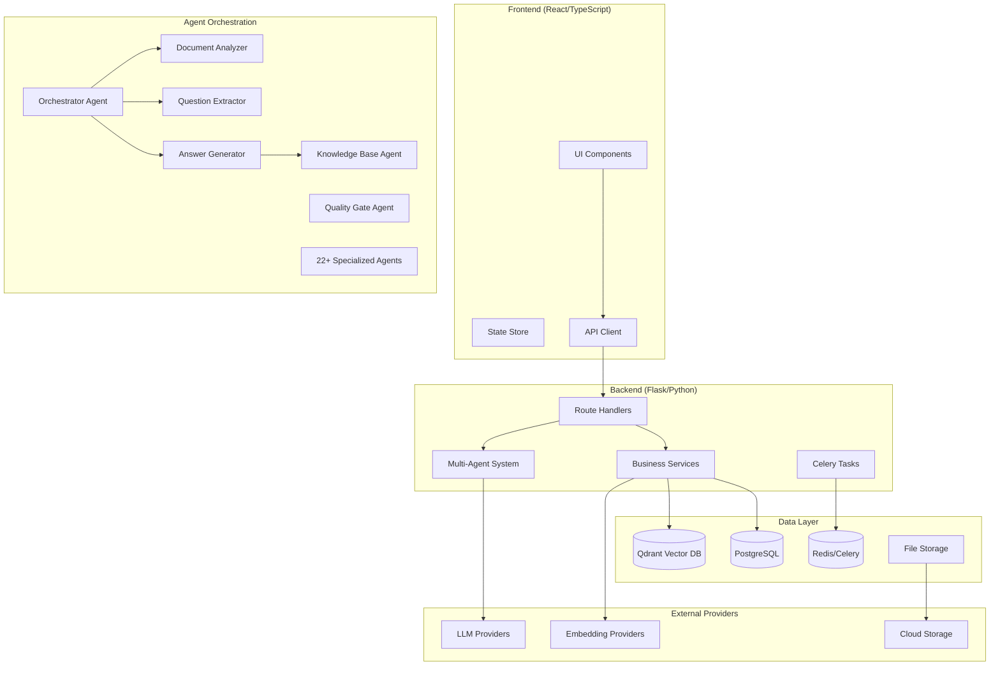

# RFP System End-to-End Audit Report

**Audit Date:** 2025-12-27  
**System:** AI-Powered RFP Proposal Generation Application  
**Auditor:** Antigravity Architecture & Systems Audit

---

## Executive Summary

This comprehensive audit evaluates the RFP Proposal Generation system across architecture, code quality, cloud-agnosticization, AI provider strategy, security, observability, and market positioning. The system demonstrates **good foundational patterns** for LLM provider abstraction and storage, but requires improvements in several critical areas.

### Overall Assessment
| Area | Rating | Priority |
|------|--------|----------|
| Architecture & Design | ⭐⭐⭐⭐ Good | - |
| Cloud-Agnosticization | ⭐⭐⭐ Moderate | High |
| AI Provider Abstraction | ⭐⭐⭐ Partial | Critical |
| Vector DB Abstraction | ⭐⭐ Limited | High |
| Security & Compliance | ⭐⭐⭐ Adequate | Medium |
| Observability | ⭐ Missing | Critical |
| Testing & QA | ⭐⭐ Basic | High |
| CI/CD Maturity | ⭐⭐ Basic | Medium |

### Key Strengths
- Multi-agent orchestration with 27 specialized agents
- LLM Provider Factory pattern with support for LiteLLM, Google, OpenAI, Azure
- Storage service abstraction (Local + GCP)
- Database-driven AI configuration per organization
- Comprehensive domain model for RFP workflow

### Critical Issues Requiring Immediate Attention
1. **17+ services bypass LLM provider abstraction** with direct `google.generativeai` calls
2. **Qdrant vector DB tightly coupled** - no abstraction for alternative vector databases
3. **No observability instrumentation** - missing OpenTelemetry, Sentry, APM
4. **Hardcoded LiteLLM proxy URL** in provider configuration

---

## Architecture Overview



### Component Summary

| Component | Technology | Files | Status |
|-----------|------------|-------|--------|
| Frontend | React 18 + TypeScript + Vite + Tailwind | ~130 components | Active |
| Backend API | Flask 3.0 + Flask-CORS + JWT | 32 route modules | Active |
| Agent System | Custom Python agents | 27 agents | Active |
| Database | PostgreSQL 15 + SQLAlchemy | 28 models | Active |
| Vector DB | Qdrant | 1 service | Coupled |
| Queue | Redis + Celery | 1 worker | Active |
| Storage | Local + GCP (abstracted) | 1 service | Good |

---

## Detailed Findings

### 1. Architecture

#### 1.1 Agent Orchestration Pattern ✅ Good
**File:** [orchestrator_agent.py](file:///home/bharathr/tarento/ai-hackathon/project/RFP/backend/app/agents/orchestrator_agent.py)

The orchestration follows a coordinator pattern where `OrchestratorAgent` manages the workflow:
1. Document Analyzer → Extracts structure and themes
2. Question Extractor → Identifies questions
3. Knowledge Base Agent → Retrieves context
4. Answer Generator → Produces responses
5. Quality Gate → Validates output

**Strengths:**
- Clear agent separation of concerns
- Factory functions for agent instantiation (`get_*_agent()`)
- Session state keys for inter-agent communication

**Issues:**
- No circuit breaker for agent failures
- No retry semantics with exponential backoff
- Agents tightly coupled via direct imports

#### 1.2 LLM Provider Abstraction ⚠️ Partial
**Files:**
- [base_provider.py](file:///home/bharathr/tarento/ai-hackathon/project/RFP/backend/app/services/llm_providers/base_provider.py) (Lines 1-165)
- [litellm_provider.py](file:///home/bharathr/tarento/ai-hackathon/project/RFP/backend/app/services/llm_providers/litellm_provider.py) (Lines 1-211)

**Good Pattern Found:**
```python
# base_provider.py - Abstract LLM provider interface
class BaseLLMProvider(ABC):
    @abstractmethod
    def generate_content(self, prompt: str, **kwargs) -> str: ...
    @abstractmethod
    def generate_chat(self, messages: List[Dict], **kwargs) -> str: ...
    def test_connection(self) -> Dict[str, Any]: ...

class LLMProviderFactory:
    @classmethod
    def create(cls, provider: str, api_key: str, model: str, ...) -> BaseLLMProvider: ...
```

**Critical Issue - Direct Google AI Calls Bypassing Abstraction:**

The following 17 files contain direct `google.generativeai` imports that bypass the provider abstraction:

| File | Line | Issue |
|------|------|-------|
| [qdrant_service.py](file:///home/bharathr/tarento/ai-hackathon/project/RFP/backend/app/services/qdrant_service.py) | 10 | Hardcoded fallback to Google |
| [ai_service.py](file:///home/bharathr/tarento/ai-hackathon/project/RFP/backend/app/services/ai_service.py) | 107 | Legacy client fallback |
| [improve_service.py](file:///home/bharathr/tarento/ai-hackathon/project/RFP/backend/app/services/improve_service.py) | 46 | Direct genai import |
| [quality_service.py](file:///home/bharathr/tarento/ai-hackathon/project/RFP/backend/app/services/quality_service.py) | 48 | Direct genai import |
| [rfp_analysis_agent.py](file:///home/bharathr/tarento/ai-hackathon/project/RFP/backend/app/services/rfp_analysis_agent.py) | 16, 96 | Direct genai imports |
| [tagging_service.py](file:///home/bharathr/tarento/ai-hackathon/project/RFP/backend/app/services/tagging_service.py) | 78 | Direct genai import |
| [go_no_go_service.py](file:///home/bharathr/tarento/ai-hackathon/project/RFP/backend/app/services/go_no_go_service.py) | 39 | Direct genai import |
| [hybrid_search_service.py](file:///home/bharathr/tarento/ai-hackathon/project/RFP/backend/app/services/hybrid_search_service.py) | 168 | Direct genai import |
| [section_generation_service.py](file:///home/bharathr/tarento/ai-hackathon/project/RFP/backend/app/services/section_generation_service.py) | 45 | Direct genai import |
| [extraction_service.py](file:///home/bharathr/tarento/ai-hackathon/project/RFP/backend/app/services/extraction_service.py) | 67 | Direct genai import |
| [classification_service.py](file:///home/bharathr/tarento/ai-hackathon/project/RFP/backend/app/services/classification_service.py) | 158 | Direct genai import |
| [compliance.py](file:///home/bharathr/tarento/ai-hackathon/project/RFP/backend/app/routes/compliance.py) | 422 | Direct genai import |
| [organizations.py](file:///home/bharathr/tarento/ai-hackathon/project/RFP/backend/app/routes/organizations.py) | 224 | Direct genai import |

---

### 2. Cloud-Agnosticization

#### 2.1 Storage Service ✅ Well Abstracted
**File:** [storage_service.py](file:///home/bharathr/tarento/ai-hackathon/project/RFP/backend/app/services/storage_service.py) (Lines 71-140)

Excellent abstraction pattern implemented:
```python
class StorageProvider(ABC):
    @abstractmethod
    def upload(self, file, original_filename, content_type, metadata) -> StorageMetadata: ...
    @abstractmethod
    def download(self, file_id) -> Tuple[bytes, StorageMetadata]: ...
    @abstractmethod
    def delete(self, file_id) -> bool: ...
    @abstractmethod
    def get_url(self, file_id, expiry_minutes) -> str: ...

# Implementations: LocalStorageProvider, GCPStorageProvider
```

**Recommendation:** Add AWS S3 and Azure Blob adapters using same pattern.

#### 2.2 GCP Hard-Coding Issues ⚠️
**File:** [docker-compose.yml](file:///home/bharathr/tarento/ai-hackathon/project/RFP/docker-compose.yml) (Lines 63-70)

```yaml
# ISSUE: GCP-specific configuration hardcoded
GOOGLE_CLOUD_BUCKET_NAME: ${GOOGLE_CLOUD_BUCKET_NAME:-bharathravi-bucket}
GOOGLE_CLOUD_PROJECT_ID: ${GOOGLE_CLOUD_PROJECT_ID:-gen-lang-client-0237694885}
GOOGLE_APPLICATION_CREDENTIALS: /app/service-account-key.json
```

**File:** `backend/service-account-key.json` - GCP service account file committed (security risk)

#### 2.3 LiteLLM Proxy Hardcoding ⚠️
**File:** [litellm_provider.py](file:///home/bharathr/tarento/ai-hackathon/project/RFP/backend/app/services/llm_providers/litellm_provider.py) (Line 37)

```python
# ISSUE: Hardcoded proxy URL
DEFAULT_BASE_URL = "https://litellm.tarento.dev"
```

---

### 3. AI Provider & Model Strategy

#### 3.1 Agent Configuration Model ✅ Good Foundation
**File:** [config.py](file:///home/bharathr/tarento/ai-hackathon/project/RFP/backend/app/agents/config.py) (Lines 28-90)

```python
class AgentConfig:
    def __init__(self, org_id: int = None, agent_type: str = 'default'):
        # Loads configuration from database per organization
        self._load_from_database(org_id, agent_type)
```

**Strengths:**
- Database-driven configuration per organization
- Agent-type specific policies
- Factory pattern for provider creation

**Missing:**
- No fallback chain configuration
- No rate limiting per agent
- No cost budget controls
- No latency SLA configuration

#### 3.2 Missing Per-Agent Runtime Policies

The current system lacks:
1. **Fallback chain** - If primary provider fails, try secondary
2. **Rate limiting** - Per-agent token/request limits
3. **Circuit breaker** - Automatic provider failover
4. **Cost tracking** - Token usage per agent per request
5. **Latency SLA** - Timeout and deadline configuration

---

### 4. Vector DB & Data Layer

#### 4.1 Qdrant Tight Coupling ⚠️ Critical
**File:** [qdrant_service.py](file:///home/bharathr/tarento/ai-hackathon/project/RFP/backend/app/services/qdrant_service.py) (Lines 27-353)

```python
class QdrantService:
    # Direct Qdrant client usage - no abstraction
    from qdrant_client import QdrantClient
    from qdrant_client.models import Distance, VectorParams, PointStruct, Filter, ...
    
    def upsert_item(self, ...):
        self.client.upsert(collection_name=self.COLLECTION_NAME, points=[...])
    
    def search(self, query, org_id, ...):
        self.client.search(collection_name=..., query_vector=..., query_filter=...)
```

**Issues:**
1. No `VectorDBAdapter` interface
2. Qdrant-specific models exposed throughout
3. Cannot swap to Milvus, Pinecone, Weaviate without major refactoring
4. Hardcoded fallback to Google embeddings (Line 120-130)

#### 4.2 Embedding Provider Abstraction ✅ Good
**File:** [factory.py](file:///home/bharathr/tarento/ai-hackathon/project/RFP/backend/app/services/embedding_providers/factory.py)

Proper abstraction for embedding providers (Google, OpenAI, Azure).

---

### 5. Security & Compliance

#### 5.1 Secrets Management ⚠️
| Finding | Severity | Location |
|---------|----------|----------|
| GCP service account key committed | Critical | `backend/service-account-key.json` |
| Hardcoded secrets in docker-compose | High | `docker-compose.yml:10-11` |
| No secrets rotation mechanism | Medium | - |

**Recommendations:**
1. Use environment variables or secrets manager (Vault, AWS Secrets Manager, Azure Key Vault)
2. Remove service-account-key.json from repo, add to `.gitignore`
3. Implement secrets rotation for API keys

#### 5.2 Authentication & Authorization ✅ Adequate
- JWT-based authentication with Flask-JWT-Extended
- Organization-scoped data access
- User role-based permissions

#### 5.3 Input Validation ⚠️
- No comprehensive input sanitization for LLM prompts
- Potential for prompt injection attacks
- Missing PII detection in RFP documents

#### 5.4 GDPR/Privacy Considerations
- No data retention policy configuration
- No PII detection/masking mechanism
- No audit logging for data access

---

### 6. Observability & Monitoring

#### 6.1 Current State ❌ Critical Gap
**Finding:** No observability instrumentation detected.

| Tool | Status |
|------|--------|
| OpenTelemetry | Not configured |
| Sentry | Not configured |
| Prometheus metrics | Not configured |
| Distributed tracing | Not configured |
| Structured logging | Partial (Python logging) |

#### 6.2 Recommended Implementation
1. Add OpenTelemetry SDK for traces and metrics
2. Instrument LLM calls with token usage metrics
3. Add Prometheus metrics endpoint
4. Implement structured JSON logging
5. Add health check endpoints with dependency status

---

### 7. CI/CD & Infrastructure

#### 7.1 Docker Configuration ✅ Good
**Files:** 
- `backend/Dockerfile` - Cloud-agnostic Python 3.11 slim
- `frontend/Dockerfile` - Cloud-agnostic Node 20 Alpine
- `docker-compose.yml` - Good service orchestration

#### 7.2 Missing Infrastructure as Code
- No Terraform modules
- No Kubernetes manifests for production
- No cloud-agnostic IaC patterns

#### 7.3 CI/CD Status ⚠️
- No GitHub Actions workflows detected
- No automated testing pipeline
- No container build/push automation

---

### 8. Testing & QA

#### 8.1 Current Test Coverage
**Directory:** `backend/tests/` (5 files)

| Test File | Coverage Area |
|-----------|---------------|
| `conftest.py` | Test fixtures, app context |
| `test_agents.py` | Agent functionality |
| `test_auth.py` | Authentication flow |
| `test_projects.py` | Project CRUD |
| `test_data_generator.py` | Test data generation |

#### 8.2 Missing Test Types
- [ ] Integration tests for LLM providers
- [ ] Contract tests for adapter layers
- [ ] E2E tests for critical workflows
- [ ] Performance/load tests
- [ ] Security tests (OWASP)

---

### 9. Performance & Scalability

#### 9.1 Identified Bottlenecks
1. **Synchronous LLM calls** - No streaming implementation
2. **Sequential agent execution** - Could parallelize independent agents
3. **Qdrant singleton** - Single connection, no connection pooling
4. **No caching layer** - Repeated embeddings for same content

#### 9.2 Recommendations
- Implement streaming LLM responses
- Add Redis caching for embeddings
- Implement connection pooling for vector DB
- Add async agent execution where possible

---

### 10. Cost Considerations

#### 10.1 Token Usage Tracking
**Status:** Not implemented

**Recommendations:**
1. Track token usage per request/agent
2. Implement cost estimation hooks in provider adapters
3. Add cost budget alerts per organization
4. Enable model selection based on cost tier

---

## Prioritized Action Items

| Priority | Item | Effort | PR Title |
|----------|------|--------|----------|
| **Critical** | Refactor 17 services to use LLM provider abstraction | L | `refactor: migrate direct google.generativeai calls to provider factory` |
| **Critical** | Add OpenTelemetry instrumentation | M | `feat: add opentelemetry tracing and metrics` |
| **Critical** | Remove service account key from repo | S | `security: remove committed credentials, add to gitignore` |
| **High** | Create VectorDBAdapter interface | M | `feat: add vector database abstraction layer` |
| **High** | Add agent fallback and circuit breaker | M | `feat: implement provider fallback chain for agents` |
| **High** | Add per-agent config with rate limits | M | `feat: add agents.yaml config with runtime policies` |
| **High** | Add AWS S3 storage adapter | S | `feat: add S3StorageProvider` |
| **Medium** | Implement token usage tracking | M | `feat: add token usage telemetry to LLM providers` |
| **Medium** | Add GitHub Actions CI pipeline | S | `ci: add github actions workflow for test and build` |
| **Medium** | Add integration tests for adapters | M | `test: add adapter layer integration tests` |
| **Medium** | Create cloud-agnostic IaC modules | L | `infra: add terraform modules for multi-cloud deployment` |
| **Low** | Add PII detection for documents | M | `feat: add pii detection and masking` |
| **Low** | Implement streaming LLM responses | M | `feat: implement streaming for generate_content` |

---

## Files Inspected

| Directory/File | Lines | Key Findings |
|----------------|-------|--------------|
| `docker-compose.yml` | 1-122 | GCP hardcoding, good service structure |
| `backend/.env.example` | 1-24 | Google-specific env vars |
| `backend/app/agents/` | 27 files | Good agent separation |
| `backend/app/agents/orchestrator_agent.py` | 1-344 | Coordinator pattern |
| `backend/app/agents/config.py` | 1-301 | Database-driven config |
| `backend/app/services/llm_providers/` | 6 files | Good factory pattern |
| `backend/app/services/embedding_providers/` | 6 files | Good abstraction |
| `backend/app/services/qdrant_service.py` | 1-353 | Tight Qdrant coupling |
| `backend/app/services/storage_service.py` | 1-523 | Excellent abstraction |
| `backend/app/services/ai_service.py` | 1-532 | Mixed abstraction |
| `backend/tests/` | 5 files | Basic coverage |
| `backend/requirements.txt` | 1-55 | GCP + Qdrant dependencies |

---

## Market Validation Appendix

> **Note:** Web search was not available in this environment. Below are recommended queries and competitor analysis framework.

### Recommended Search Queries

1. `"RFP automation software" site:g2.com OR site:capterra.com`
2. `"proposal management software" comparison 2024`
3. `"AI proposal generation" tools enterprise`
4. `"bid management automation" AI features`
5. `"knowledge-to-proposal" AI platforms`

### Competitor Analysis Framework

| Competitor | Category | Key Features | Strengths | Weaknesses |
|------------|----------|--------------|-----------|------------|
| **Loopio** | RFP Response | Content library, AI drafting, collaboration | Market leader, deep integrations | Enterprise pricing |
| **Responsive (RFPIO)** | Proposal Mgmt | AI recommendations, project tracking | Scalability, analytics | Complex setup |
| **Qvidian** (Upland) | Proposal Automation | Content library, compliance check | Enterprise features | Legacy UI |
| **Proposify** | Proposal Software | Templates, e-signatures, analytics | SMB-friendly, modern UI | Limited AI |
| **PandaDoc** | Document Automation | Templates, e-sign, CRM integration | Ease of use | Not RFP-focused |
| **Ombud** | RFP AI Platform | AI-powered responses, knowledge base | Modern AI approach | Newer entrant |

### Features to Consider Adopting

1. **Content library with smart search** - Knowledge base already exists, enhance discoverability
2. **AI confidence scoring** - Implemented, consider UX improvements
3. **Collaboration workflows** - Add commenting, assignment, approvals
4. **Compliance checking** - Enhance existing compliance agent
5. **Analytics dashboard** - Add win/loss analysis, response time metrics
6. **CRM integrations** - Salesforce, HubSpot connectors
7. **Template management** - Export template system exists, add more flexibility

---

## Sanity Check Commands

Run these commands to validate the current state and recommended changes:

```bash
# 1. Check for direct google.generativeai imports
grep -r "import google.generativeai" backend/app --include="*.py" | wc -l
# Expected: Should reduce to 2 (embedding provider + llm provider only)

# 2. Verify LLM provider factory
python -c "from app.services.llm_providers import LLMProviderFactory; print(LLMProviderFactory.list_providers())"
# Expected: ['litellm', 'google', 'openai', 'azure']

# 3. Check for hardcoded secrets
grep -r "service-account-key" . --include="*.yml" --include="*.yaml"
# Expected: Should be empty after fix

# 4. Verify storage abstraction
python -c "from app.services.storage_service import StorageService; print(StorageService.get_instance().storage_type)"
# Expected: 'local' or 'gcp' based on env

# 5. Run existing tests
cd backend && python -m pytest tests/ -v
# Expected: All tests pass

# 6. Check for missing observability
grep -r "opentelemetry" backend/app --include="*.py" | wc -l
# Expected: Should show instrumentation after adding

# 7. Verify Qdrant connection
python -c "from app.services.qdrant_service import get_qdrant_service; qs = get_qdrant_service(); print(qs.enabled)"
# Expected: True

# 8. Check embedding providers
python -c "from app.services.embedding_providers import EmbeddingProviderFactory; print(EmbeddingProviderFactory.list_providers())"
# Expected: ['google', 'openai', 'azure']

# 9. Validate Flask app starts
cd backend && flask routes | head -20
# Expected: List of registered routes

# 10. Check Docker build
docker-compose build --dry-run 2>&1 | grep -i error
# Expected: No errors
```

---

*Report generated by Antigravity Architecture & Systems Audit*
